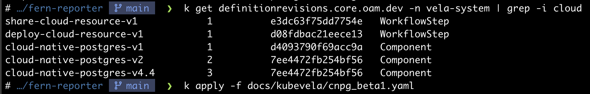
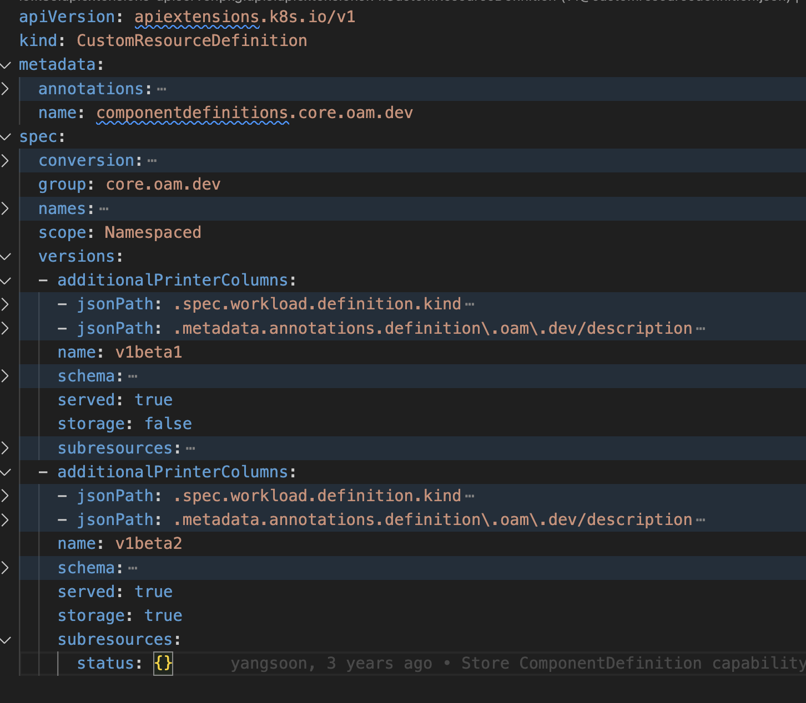
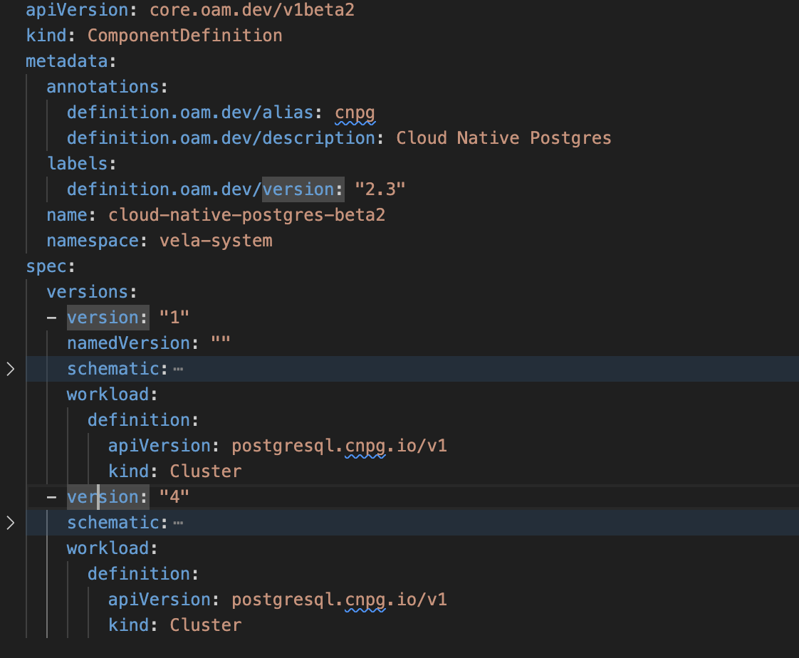

# Versioning Support for KubeVela Definitions

<!-- toc -->
- [Versioning Support for KubeVela Definitions](#versioning-support-for-kubevela-definitions)
  - [Summary](#summary)
  - [Motivation](#motivation)
      - [TODO](#todo)
    - [Goals](#goals)
    - [Non-Goals](#non-goals)
  - [Acceptance Criteria](#acceptance-criteria)
  - [Current Implementation](#current-implementation)
      - [Reference:](#reference)
  - [Proposal 1](#proposal-1)
    - [Proposal Details](#proposal-details)
      - [Issues](#issues)
  - [Proposal 2](#proposal-2)
      - [ComponentDefinition CRD](#componentdefinition-crd)
      - [ComponentDefinition v1Beta2 Object](#componentdefinition-v1beta2-object)
    - [Implementation Details](#implementation-details)
      - [Reasons for selecting `v1Beta1` for storage:](#reasons-for-selecting-v1beta1-for-storage)
      - [Notes/Considerations](#notesconsiderations)
    - [Upgrading](#upgrading)
    - [How to handle existing components](#how-to-handle-existing-components)
<!-- /toc -->

## Summary

Support explicit versioning for KubeVela Definitions and a way to specify which
version of the ComponentDefinition is to be used in an Application spec.

## Motivation

OAM/KubeVela Definitions (referred to as Definitions or Components for the rest
of the document) are the basic building blocks of the KubeVela platform. They
expose a contract similar to an API contract, which evolves from minor to major
versions. Definitions currently do have a `Revision` field in the Status, but it is automatically assigned and is an integer.

Such a versioning scheme does not denote the type of the change (patch/bug, minor or major).

Applications are composed of definitions that the KubeVela engine stitches
together. KubeVela automatically upgrades/reconciles the Application to the
latest when no Definition Revision is specified. While we don't ideally want
Application developers to bother with such details, there are use cases where automatic upgrade to the latest Definition version is not desired.

- It is an issue faced by many Kubevela community members; see the reference
  below.
#### TODO

- This can be resolved by specifying a Revision number when referring the Component in an Application, but as the current versioning scheme does not provide hints on the type of change, it cannot be automated well.

### Goals

- Support Definitions versioning using Semantic Versions.
- Allow pinning, specific and non-specific versions of a Definition in the
  Kubevela Application.

### Non-Goals

- Support for version range in Application. For eg.`type: my-component@>1.2.0`

## Acceptance Criteria

**User Story: Definition version specification**

>**As a** Definition author\
>**I should** be able to publish every revision of my Definitions with the Semantic Versioning scheme\
>**So that** an Application developer can use a specific revision of the Definition

**BDD Acceptance Criteria**

>**Given** a Definition spec\
>**AND** a version field of the spec set to V\
>**When** the Definition is applied to the KubeVela\
>**Then** it should be listed as one of the many versions in the Definition list

**User Story: Application Definition version specification**

>**As an** Application developer\
>**I should** be able to specify a revision (complete or partial) for every Definition used\
>**So that** I can control which revisions are deployed

**BDD Acceptance Criteria**

>Scenario: Use the version specified in the application manifest when deploying the service\
>**Given** a Definition A with version 1.2.3\
>**And** a Definition B with version 4.5.6\
>**And** an application composed of A 1.2.2 and B 4.4.2\
>**When** the application is deployed\
>**Then** it uses Definition A 1.2.2 and B 4.4.2

>**Variant:** use the latest version for the part of the semVer that is not specified.\
>**And** an application composed of A 1.2 and B 4\
>**When** the application is deployed\
>**Then** it uses Definition A 1.2.3 and B 4.5.6

## Current Implementation

Currently Kubevela has some basic support for controlling Definition versions based on K8s annotations and DefinitionRevisions. The annotation "definitionrevision.oam.dev/name" can be used to version the ComponentDefinition. For example if the following annotation is added to a ComponentDefinition, it produces a new DefinitionRevision and names the ComponentDefinition as "component-name-v4.4" .

`definitionrevision.oam.dev/name: "4.4"`

This Component can then be referred in the Application as either of the following:

>"component-name@v4.4" - `NamedDefinitionRevision`\
>"component-name@v3"   - `DefinitionRevision`

This versioining scheme, although convenient, has the following issues:

- Since, there are more than one ways to reference a Component (`NamedDefinitionRevision` or `DefinitionRevision`), it proves difficult to maintain version consistency across clusters.
- Each change in the ComponentDefintion Spec creates a new DefinitionRevision only if the annotation `definitionrevision.oam.dev/name` is not present at all.
- If there is change in the ComponentDefintion Spec when the annotation  `definitionrevision.oam.dev/name` is present and not updated, the DefinitionRevision is updated in place.

#### Reference:

https://kubevela.io/docs/platform-engineers/x-def-version/

## Proposal 1

### Proposal Details

This implementation, referred [here](https://github.com/kubevela/kubevela/issues/6435#issuecomment-1892372596), proposes adding another explicit annotation for keeping track of ComponentDefinition Revisions. For example, we can add an annotation like `definitionrevision.oam.dev/version` and use that to generate the ComponentDefinition Revisions.

#### Issues

- It might be very confusing for the users, because there is no easy way to differentiate or recognize how the Revision was generated.
- If both the annotations  `definitionrevision.oam.dev/name` and `definitionrevision.oam.dev/version` are present, there is no clear way to decide the Revision behaviour without breaking backward compatibility.

## Proposal 2

This proposal targets following major changes:

- Add a new API version(`v1Beta2`) for ComponentDefinition CRD to support the new versioning model. All current CRD versions should continue to work as is.
- Use Semantic versioning for each new version of a ComponentDefinition.
- Use the Kubernetes model for storing the ComponentDefinition versions, which is to store an array of all version Spec's. Each individual Spec will also include a new field called `version`.
- Kubevela Application users can refer to a particular version of a ComponentDefinition like `component-name@component-version`.
- The `version` must be a valid SemVer without the prefix `v` for example,
`1.1.0`, `1.2.0-rc.0`.

#### ComponentDefinition CRD

#### ComponentDefinition v1Beta2 Object

The Application will then have the ability to refer to the version when using a
Definition like this
    apiVersion: core.oam.dev/v1beta1
    kind: Application
    metadata:
        name: app-with-comp-versioning
    spec:
        components:
            - name: backend
              type: my-component-type@1.0.2
### Implementation Details

Kubernetes only supports storing one API Version per CRD. We are planning to store the current( `v1Beta1`) API version objects of ComponentDefinitions. We will need to implement a Conversion webhook to translate the incoming object from `v1Beta2` to `v1Beta1`. It essentially means that when we add a new API Version to supoprt this proposal, only "v1Beta1" ever gets stored in the database.

#### Reasons for selecting `v1Beta1` for storage:

-  We don't have to migrate existing Component Definitions to the new API Version as part of the Kubevela upgrade.
-  In the interest of backward compatibility and stability, it is generally advisable to mark the most stable API Version of the CRD for storage. [Crossplane](https://github.com/crossplane-contrib/provider-upjet-aws/blob/main/apis/ec2/v1beta1/zz_instance_types.go#L1348 ) support for multiple version also implements this.

#### Notes/Considerations
- K8s GET resource call always returns the latest version by default ( https://kubernetes.io/docs/tasks/extend-kubernetes/custom-resources/custom-resource-definition-versioning/#version-priority ). When `v1Beta1` objects are accesed, the conversion webhook will be used to translate the result to `v1Beta2` before being returned.
- When a new Component is created with `v1Beta2` API target, the following objects will be stored:
  - A Component with `v1Beta1` API target which only includes the Spec of the highest version from the `v1Beta2` object.
  - A DefinitionRevision for each version will be created/updated for each version in the `v1Beta2`  object.
- We need to be able to store all  the information of the new API Version object. One way to do this is via adding a [new annotation](https://github.com/shivi28/kube-vaccine/blob/main/api/v2/conversion.go).
- Conversion webhooks work via a [Hub and Spoke model](https://book.kubebuilder.io/multiversion-tutorial/conversion-concepts). It is not required that the API Version stored in the database and the API version marked as the Hub should be the same.The Hub can then be marked as per ease of implementation.

### Upgrading

When selecting a Definition version in the application spec, it will be possible to
select a non-specific version, like `v1.0` or `v1`. KubeVela will
auto-upgrade the application to use the latest version in the specified version
series. For instance, if the application specifies `type: my-component-type@1.0`
and `v1.0.1` of the Definition is available, KubeVela will re-render the
application using this version.

In case no Definition version is specified, the latest version available at the time of Application creation will be pinned.

KubeVela will initiate the reconciliation of the Application as soon as a new
version of a component is available and the application is eligible (based on
the version specificity) to be upgraded.

> **Proposal Notes:** We are intentionally planning to add a flag like auto-upgrade:
> true|false if one does not want to auto-upgrade their component, they should
> always use specific semVer in the application spec. This is also consistent
> with existing behaviour where we always use the latest version of the
> Definition when the application reconciles. We are just providing a way to opt
> out of this behaviour by pinning the component version in the application.
> This is also in line with the philosophy of keeping complexity at the platform
> level instead of the application level.

> **For Definition Maintainers:** Ideally the upgrades to Definition
> should be backwards compatible for a given Major version. Updates to
> Definitions should never force the application spec to change. If a new
> component is changing something significant it should be a Definition with a
> new name and not the new version of the existing Definition.

### How to handle existing components

- We will treat the existing `v1Beta1` Definition API Version as legacy API. Theses Components will continue to behave the same way, including their usage in an Application. The Applications will be updated only when the Component reference in the Application is explicitly updated. This also applies to Applications & Components using the current `NamedDefinitionRevision` or `DefinitionRevision` versioning.
- An upgrade to KubeVela with this new versioning scheme support will automatically make it available for use. There will be no need for an explicit declaration.
- Conversion of components between API Versions will be blocked. For example, a Component defined using the `v1Beta1` API cannot be edited to `v1Beta2` API version or vice-versa, even though due to K8s behaviour all objects will be disaplyed after translation to the latest version. This translation will be implicit and will be handled by the conversion webhooks.
- All auto upgrade behaviour will only apply to `v1Beta2` API Components and will need to be enabled via deployment flags.
